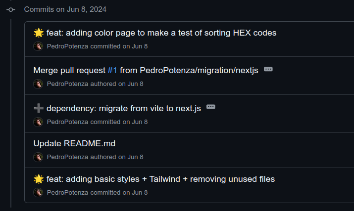

# 🎨 Art Archive

## 📖 Overview

The **Art Archive Front** is a React-based web application designed for exploring and interacting with artworks in a modern and intuitive way. The project leverages technologies like Next.js, TypeScript, Tailwind CSS, and Firebase to deliver a seamless user experience. Additionally, a Python-based proxy handles backend operations for optimized API consumption.

The application was built as a **Minimum Viable Product (MVP)** to provide a solid foundation for future expansions, such as personalized user feeds and advanced filtering capabilities.

## 🚀 Key Features

- **Artwork Grid**: Infinite scrolling grid of artworks with lazy loading and placeholder colors for enhanced UX.
- **Advanced Filters**: Filter by attributes like color, material, technique, period, and more.
- **Dynamic Artwork Details**: View comprehensive information about selected artworks, including artists, dimensions, and predominant colors.
- **User Authentication**: Login and registration with Google OAuth integration.
- **Custom Collections**: Save artworks into personal archive boxes (planned feature).
- **Optimized Performance**: Includes lazy loading, proportional image grids, and efficient API requests.

## 🛠 Installation and Setup

### Using Docker Compose

1. Clone the repository:
   ```bash
   git clone https://github.com/PedroPotenza/Art-Archive-Front.git
   cd Art-Archive-Front
   ```
2. Run the application:
   ```bash
   docker compose up
   ```

### Without Docker

1. Clone the repository:
   ```bash
   git clone https://github.com/PedroPotenza/Art-Archive-Front.git
   cd Art-Archive-Front
   ```
2. Install dependencies:
   ```bash
   npm install
   ```
3. Set up the Python-based proxy (First time):

   ```bash
   cd proxy/
   python -m venv artArchive_python
   source artArchive_python/bin/activate
   pip install -r requirements.txt
   python proxy.py
   ```

   After already set up the venv, run:

   ```bash
   cd proxy/
   source artArchive_python/bin/activate
   python proxy.py
   ```

4. Run the development server:
   ```bash
   npm run dev
   ```
5. Access the application at `http://localhost:3000`.

## 🔧 Tools and Workflow

### Commit Standards: Husky + Commitizen + Emoji Conventional

This project follows **semantic commit standards** using the Husky + Commitizen + Emoji Conventional combo for structured and descriptive commit messages.

To create a commit:

1. Run `git cz` or `git commit` to access the commit message menu.
2. Follow the prompts to generate a semantic commit message with emojis.

#### Example:

[Screencast from 08-06-2024 00:27:46.webm](https://github.com/PedroPotenza/Art-Archive-Front/assets/83480686/ce2e1e32-c361-4b8f-a1c0-9f16bb1e0b6c)

(when GNU Nano opens, I just type Ctrl + X to exit)

#### Result:



---

## 📂 Project Structure

```
Art-Archive-Front/
├── docker-compose.yml    # Docker configuration
├── documentation/        # Contains diagrams, notes, and project documentation
├── proxy/                # Python-based proxy for backend requests
├── src/                  # Frontend source files
│   ├── components/       # Reusable UI components
│   ├── app/              # Next.js routing and pages
│   ├── libs/             # API and Firebase configurations
│   ├── hooks/            # Custom hooks
│   └── util/             # Helper functions and models
├── public/               # Static assets
├── styles/               # Tailwind CSS configurations
├── package.json          # Dependencies and scripts
└── README.md             # Documentation
```

### Key Files:

- **`proxy.py`**: Handles backend operations like API request redirection and data normalization.
- **`filterSideMenu.tsx`**: Implements advanced filtering functionality.
- **`imageViewer.tsx`**: Provides interactive image viewing with tooltips.

---

## 📚 Documentation

- [Figma Prototype](https://www.figma.com/design/MsPqVyoHSHn9voeHd1Ebfy/Art-Archive?node-id=0-1&t=zHTmqiityQr73TZE-1)
- [Harvard Art Museum API](https://github.com/harvardartmuseums/api-docs)
- [Activity Diagrams and Documentation](./documentation/)

---

## 🤝 Contributing

We welcome contributions! Please adhere to the following guidelines:

1. Fork the repository and create a branch (`feature/your-feature-name`).
2. Commit changes using semantic messages.
3. Submit a pull request for review.

---

## 📜 License

This project is licensed under the **MIT License**. See the [LICENSE](./LICENSE) file for details.

---

## 🌟 Future Improvements

- Enhanced user personalization with "For You" grids.
- Integration of multiple APIs for diverse artwork data.
- Implementation of advanced data normalization for optimized requests.

---
